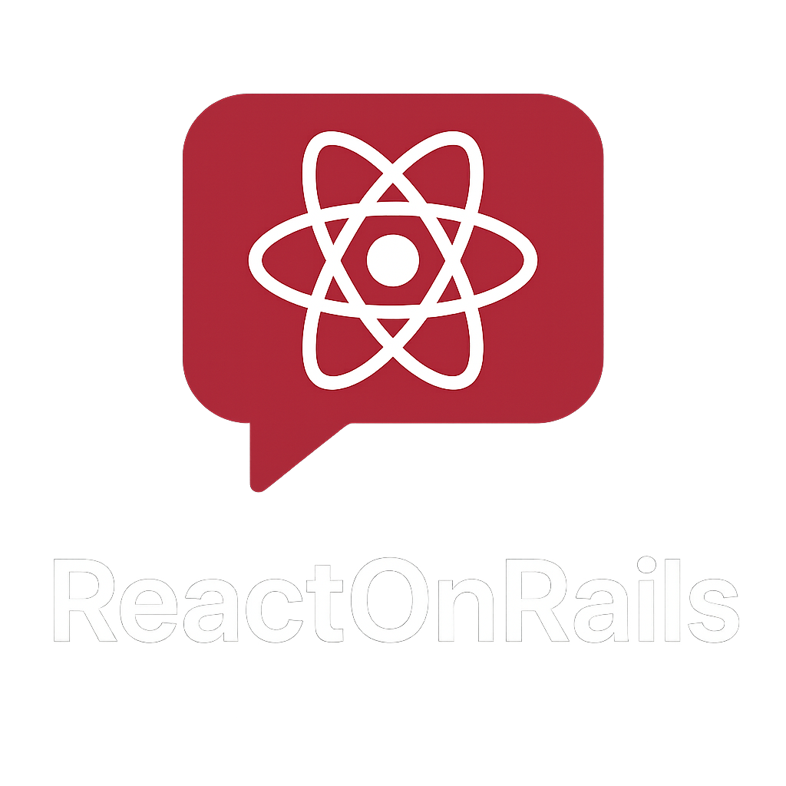

<p align="center">
  
</p>

---

# ReactOnRails

A **real-time chat application** built with **React** (frontend) and **Ruby on Rails** (backend) leveraging **Action Cable/WebSocket** technology. This project demonstrates full-stack development expertise and modern real-time web application architecture.

🌐 Live App — Hosted on Render free tier (server may take a few seconds to wake up).

🎬 Watch Demo — See the real-time chat in action!

## 🚀 Project Overview

ReactOnRails showcases seamless integration between a React frontend and Rails API backend, powered by WebSocket technology for instant messaging. Originally started as "chat-app-first" during development, it evolved into a comprehensive demonstration of modern web development practices and real-time communication patterns.

## ✨ Key Features

- **Real-time messaging** using WebSockets and Action Cable
- **JWT-based authentication** for secure user sessions  
- **RESTful API architecture** following Rails conventions
- **Modern React frontend** with hooks and responsive design
- **Optimized database queries** with eager loading and pagination
- **WebSocket connection resilience** with automatic reconnection
- **Scalable messaging system** supporting multiple concurrent users
- **User-based access control** to secure message access
- **Easily extendable** for groups, notifications, and additional features

## 🛠 Tech Stack

### Frontend
- **ReactJS** with modern hooks and functional components
- **React Router** for client-side routing
- **Axios** for API requests and HTTP client
- **WebSocket API** for real-time communication
- **Modern JavaScript (ES6+)** with arrow functions

### Backend  
- **Ruby on Rails 7+** with API-first architecture
- **Action Cable** for WebSocket real-time messaging
- **JWT (JSON Web Tokens)** for stateless authentication
- **PostgreSQL** database with optimized schema design
- **Active Record** with advanced query optimization
- **RSpec** for comprehensive backend testing

### Development & DevOps
- **Git** with meaningful commit history and branching strategy  
- **Environment configuration** with secure credential management
- **Database migrations** for schema versioning
- **RESTful API design** with proper HTTP status codes
- **CORS configuration** for secure cross-origin requests

## 📋 Installation & Setup

### Prerequisites
- Ruby 3.4+ and Rails 8+
- Node 24.6+ and npm
- PostgreSQL database
- Git for version control

### Backend (Rails API)

```bash
# Clone the repository
git clone https://github.com/thasbeeh/react-on-rails.git
cd react-on-rails

# Install Ruby dependencies
bundle install

# Database setup with migrations
rails db:create 
rails db:migrate 
rails db:seed

# Start the Rails server (API backend)
rails server
# Backend will run on http://localhost:3000
```

### Frontend (React)

```bash
# Navigate to frontend directory
cd chatable

# Copy environment configuration
cp .env.example .env.development

# Install Node.js dependencies  
npm install

# Start the React development server
npm run dev
# Frontend will run on http://localhost:5173
```

**Important**: Ensure frontend API requests point to your Rails backend at `http://localhost:3000/api/v1`.

## 🎯 Usage & Features

### Getting Started
1. **Sign up** for a new account or **log in** with existing credentials
2. **Browse available users** in the user list  
3. **Select a user** to start a conversation
4. **Send messages** that appear instantly via WebSocket connection
5. **Real-time updates** without page refresh or polling
6. **Secure logout** to end authenticated session

### Real-time Capabilities
- **Instant message delivery** across all connected clients
- **Automatic reconnection** if WebSocket connection drops
- **Message persistence** with database storage

## 📁 Project Structure

```
react-on-rails/
├── app/
│   ├── controllers/api/v1/     # API controllers
│   ├── models/                 # ActiveRecord models  
│   ├── channels/               # Action Cable channels
│   └── serializers/            # JSON API serializers
├── frontend/
│   ├── src/
│   │   ├── components/         # React components
│   │   ├── hooks/              # Custom React hooks
│   │   ├── services/           # API service layer
│   │   └── utils/              # Helper utilities
│   ├── public/                 # Static assets
│   └── package.json            # Frontend dependencies
├── config/
│   ├── routes.rb               # API routing
│   ├── cable.yml               # WebSocket configuration  
│   └── database.yml            # Database configuration
├── db/
│   ├── migrate/                # Database migrations
│   └── seeds.rb                # Sample data
├── spec/                       # RSpec test suite
├── .env.example                # Environment variables template
├── .gitignore                  # Git ignore patterns
└── README.md                   # This file
```

## 🤝 Contributing

Contributions are welcome! Please feel free to submit a Pull Request. For major changes, please open an issue first to discuss what you would like to change.

### Development Setup
1. Fork the repository
2. Create a feature branch (`git checkout -b feature/amazing-feature`)
3. Commit your changes (`git commit -m 'Add amazing feature'`)
4. Push to the branch (`git push origin feature/amazing-feature`)
5. Open a Pull Request

## 📝 What This Project Demonstrates

### Technical Competencies
- **Full-stack development** with modern JavaScript and Ruby
- **Real-time web application** architecture and implementation
- **API design and development** following REST principles
- **Database design and optimization** for scalable applications  
- **Authentication and security** best practices
- **WebSocket programming** and real-time communication protocols
- **Frontend state management** and component architecture
- **Performance optimization** and debugging methodologies

### Development Practices
- **Problem-solving approach** to complex technical challenges
- **Debugging and troubleshooting** skills across the full stack
- **Code organization** and architectural decision-making
- **Version control** and collaborative development workflows
- **Documentation** and technical communication skills

## 📄 License

This project is open source and available under the [MIT License](LICENSE).

---

**ReactOnRails** represents a comprehensive exploration of modern web development technologies, demonstrating the seamless integration of React and Rails for building sophisticated real-time applications. From initial routing challenges to final deployment, this project showcases the complete development lifecycle and the problem-solving journey that transforms ideas into working software.
